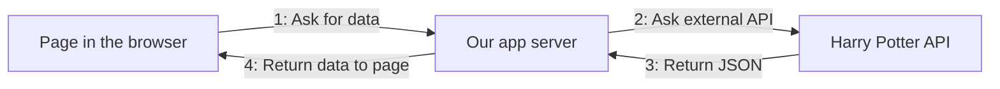
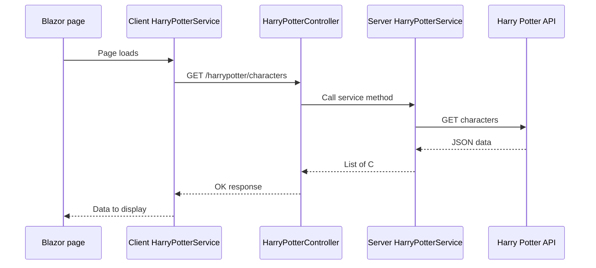

# Setting Up an API

This task is part of the WorkExperience project. The aim is to help you understand what you are building, how data moves through the app, and which files matter most.

If you are new to APIs, Blazor, or client-server projects, that is completely fine. You do **not** need to understand every line straight away. The aim is to see the big picture first, then connect that picture to the code.

## Learning outcomes

By the end of this guide, you should be able to:

- Describe how data moves through a client-server Blazor app.
- Trace one request from a page to a controller, service, and the Harry Potter API.
- Explain why this project uses services, controllers, interfaces, and `async`/`await`.
- Find the main files involved in loading characters and rebuilding spells.

## Success criteria

You are successful when you can:

- Run the app and open the **Characters** page.
- Explain, in order, which method and endpoint are used to load characters.
- Point to the file you would open to change the page, the server route, or the Harry Potter API call.
- Point to the files you would change to rebuild the Spells challenge.
- Say why this project should use `async`/`await` instead of a synchronous approach.

## Keep these ideas in mind

- The Blazor page does **not** call the Harry Potter API directly. It calls our own app server first.
- `async` does **not** just mean “faster”. In this task, it means the app can wait for a result **without blocking the app**.
- If you get stuck, come back to these three questions: **Which part is front-end? Which part is back-end? Which route is being called?**

## Before you start

1. Open `WorkExperience.sln` in Visual Studio.
2. Run the `HarryPotter.Server` project. This project hosts the app and the controller the client calls. If you are using the command line, run `dotnet run --project HarryPotter.Server\HarryPotter.Server.csproj` from the `WorkExperience` folder.
3. When the browser opens, go to the home page and open **Characters** from the menu, or browse directly to `/characters`.
4. The app is working if the **Characters** page loads, the loading indicator appears briefly, and then character cards are shown.
5. As a second check, open `/spells` and confirm that the **Spells Challenge** page opens and explains what you need to build.

## What you will do

1. You will run the app and confirm that the Characters page works.
2. You will follow one request from the page, through our app server, to the Harry Potter API, and back to the screen.
3. You will open the key files and match each file to one job in that journey.
4. You will use the Characters flow as your reference when you rebuild the Spells challenge.

## A few words in plain English

Before you read the code, these terms will help:

- **API:** A way for one application to ask another application for data.
- **Endpoint:** A specific API address, such as `characters` or `spells`.
- **Client:** The front-end that the user sees in the browser.
- **Server:** The back-end that does extra work for the client.
- **JSON:** The text format the API uses to send data.
- **Service:** A class that contains logic for a task, such as making an HTTP request.
- **Controller:** A class on the server that receives web requests.

## Big picture

At the highest level, there are only three places to think about:

- the **page in the browser**
- **our app server**
- the **Harry Potter API**



If the diagram does not render in your editor, read it from left to right:

**page in browser -> our app server -> Harry Potter API -> back again**

## One full example journey: loading the Characters page

Follow this one example all the way through:

1. The browser opens `/characters`, so Blazor loads `HarryPotter.Client\Pages\Characters.razor`.
2. Inside `OnInitializedAsync()`, the page calls `HarryPotterService.GetCharactersAsync()`.
3. The client-side service in `HarryPotter.Client\Core\Services\HarryPotterService.cs` sends `GET harrypotter/characters` to our own app server.
4. `HarryPotter.Server\Controllers\HarryPotterController.cs` receives that request in `GetCharacters()`.
5. The controller asks `IHarryPotterService.GetCharactersAsync()` to do the work.
6. `HarryPotter.Server\Services\HarryPotterService.cs` sends `GET characters` to the Harry Potter API at `https://hp-api.onrender.com/api/`.
7. The Harry Potter API returns JSON. The server service reads the response text and turns that JSON into a `List<Character>`.
8. The controller sends that result back to the client as an `OK` response.
9. The client-side service reads the response text, turns it into client-side `Character` objects, and returns them to the page.
10. `Characters.razor` stores the returned data in `CharacterList`, and the UI renders the character cards.

## What happens when a page loads



## Why are we using a server in the middle?

You might ask: why not call the Harry Potter API straight from the browser?

Using our own server is useful because it:

- keeps the front-end talking to our back-end, rather than directly to the Harry Potter API
- gives us one place to organise routes such as `harrypotter/characters`
- makes it easier to add checks, logging, and error handling later
- matches how many real web apps are built

## Inspect the files in this order

Use the example journey above, then open these files one by one.

| File | Why it matters | When would I open this? |
| --- | --- | --- |
| `HarryPotter.Client\Pages\Characters.razor` | This page loads and shows character data. | Open this when you want to see what the user sees or what happens when the page first loads. |
| `HarryPotter.Client\Pages\Spells.razor` | This is now a scaffolded challenge page rather than a finished feature. | Open this when you want to see what you need to build next. |
| `HarryPotter.Client\Core\Services\HarryPotterService.cs` | This service sends requests from the client to our app server. | Open this when you want to check which route the front-end is calling now, or where to add the spells route later. |
| `HarryPotter.Server\Controllers\HarryPotterController.cs` | This controller receives requests from the client and returns results. | Open this when you want to see the current character route or add the spells route. |
| `HarryPotter.Server\Interfaces\IHarryPotterService.cs` | This interface says what the server service must be able to do. | Open this when you want to check which methods the server service has now, or which one you need to add for spells. |
| `HarryPotter.Server\Services\HarryPotterService.cs` | This service calls the Harry Potter API and turns JSON into C# objects. | Open this when you want to change the Harry Potter API endpoint or copy the pattern for spells. |
| `HarryPotter.Server\Program.cs` | This file registers services and sets the Harry Potter API base address. | Open this when you want to see how the server starts up or where the API base URL is configured. |

## What to notice in each file

### 1. The pages

Open:

- `HarryPotter.Client\Pages\Characters.razor`
- `HarryPotter.Client\Pages\Spells.razor`

Notice that:

- `Characters.razor` is the working example
- `Spells.razor` is the unfinished challenge
- both pages help you see what the user sees in the browser
- the Characters page shows the full pattern you will copy for spells

Start here if you want to answer the question, **“What happens when the page first opens?”**

### 2. The client-side service

Open:

- `HarryPotter.Client\Core\Services\HarryPotterService.cs`

This service does **not** call the Harry Potter API directly. It calls **our own app server** instead.

Notice these points:

- `HttpClient` is injected into the service.
- The base route is `harrypotter/`.
- The current route used here is `harrypotter/characters`.
- One part of your Spells challenge is to add the spells route back in.

Open this file when you want to answer the question, **“What request is the front-end sending?”**

#### Use `async` and `await` here

For this project, this method should be **asynchronous**:

- use **asynchronous** methods
- use `async`
- use `await`

That is the normal approach for API calls in modern C#.

Example:

```csharp
public async Task<List<Character>> GetCharactersAsync()
{
    HttpResponseMessage response = await _httpClient.GetAsync($"{BaseAddress}characters");
    response.EnsureSuccessStatusCode();

    string json = await response.Content.ReadAsStringAsync();
    List<Character>? characters = JsonSerializer.Deserialize<List<Character>>(json);

    return characters ?? new List<Character>();
}
```

`await` means the app waits for the result **without blocking the app**.

### 3. The controller and interface

Open:

- `HarryPotter.Server\Controllers\HarryPotterController.cs`
- `HarryPotter.Server\Interfaces\IHarryPotterService.cs`

The controller currently receives requests such as:

- `harrypotter/characters`

The controller does not call the Harry Potter API itself. Instead, it passes the work to `IHarryPotterService`.
When you build spells, you will add a matching spells route here too.

The interface is a simple promise about what the service can do:

- `GetCharactersAsync()`

When you rebuild spells, you will add a spells method to the interface as well.

Open these files when you want to answer the questions, **“Which URL is my client calling?”** and **“Which server method should handle it?”**

### 4. The server-side service

Open:

- `HarryPotter.Server\Services\HarryPotterService.cs`

This is the part that actually talks to the Harry Potter API.

The main steps are:

1. `GetAsync(...)` sends the web request.
2. `ReadAsStringAsync()` reads the returned data as text.
3. `JsonSerializer.Deserialize(...)` turns the JSON text into C# objects.
4. The method returns those objects to the controller.

Open this file when you want to answer the question, **“Where does the app call the Harry Potter API?”**

### 5. Startup and configuration

Open:

- `HarryPotter.Server\Program.cs`

This file shows how the server is set up, including the base address:

- `https://hp-api.onrender.com/api/`

Open this file when you want to answer the question, **“Where is the Harry Potter API base URL configured?”**

## What you should focus on as you work

If you are unsure what matters most, focus on these five ideas:

1. **Models** match the shape of the JSON data.
2. **Services** keep HTTP code out of the UI pages.
3. **Controllers** give the client a clean route to call.
4. **Interfaces** describe what a service should do.
5. **Async/await** is how C# usually handles API calls.

## What you do not need to worry about too much yet

At this stage, it is fine if these feel a bit advanced:

- why dependency injection works behind the scenes
- the full theory of interfaces
- every detail of how `HttpClient` is set up
- every nullable warning in the codebase

The key thing is understanding the flow of data through the app.

## Troubleshooting

- **The app does not start:** Make sure `HarryPotter.Server` is the project you are running.
- **The page opens but no data appears:** Refresh the page, then check whether the loading indicator appears. If needed, browse to `https://localhost:7147/harrypotter/characters` or `http://localhost:5160/harrypotter/characters` to see whether the server route returns data.
- **The Spells page does not show data yet:** That is expected. The Spells page is intentionally unfinished until you build the missing model and API flow.
- **You get an error after adding `await`:** Check that the method also uses `async` and returns `Task<...>` rather than just `List<...>`.
- **The browser shows a certificate warning on HTTPS:** Use the HTTP launch profile or trust the local development certificate in Visual Studio.
- **You are not sure which file to open:** Open the `.razor` page for UI changes, the controller for route changes, and the server service for Harry Potter API call changes.

## Helpful learning links

### C# basics

- [C# documentation overview](https://learn.microsoft.com/dotnet/csharp/)
- [Introduction to C#](https://learn.microsoft.com/dotnet/csharp/tour-of-csharp/)
- [C# variables and data types](https://learn.microsoft.com/en-us/dotnet/csharp/tour-of-csharp/tutorials/hello-world)
- [Methods in C#](https://learn.microsoft.com/dotnet/csharp/programming-guide/classes-and-structs/methods)
- [Async and await in C#](https://learn.microsoft.com/dotnet/csharp/asynchronous-programming/)

### Blazor and web API basics

- [Blazor overview](https://learn.microsoft.com/aspnet/core/blazor/)
- [Build your first Blazor app](https://learn.microsoft.com/aspnet/core/blazor/get-started/)
- [Dependency injection in Blazor](https://learn.microsoft.com/aspnet/core/blazor/fundamentals/dependency-injection)
- [ASP.NET Core Web API overview](https://learn.microsoft.com/aspnet/core/web-api/)

## Good extension ideas if you finish early

1. Add search or filtering to the finished Spells page.
2. Show a friendly error message when an API call fails.
3. Add another Harry Potter endpoint such as students, staff, house, or character by ID.
4. Create a new server endpoint that reshapes the data before sending it to the client.
